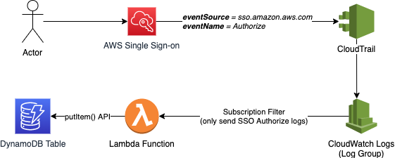

# Logging AWS SSO Authorize Events

When using [Amazon Single Sign-on (SSO)](https://aws.amazon.com/single-sign-on/), every login event (and other event types) are logged by [AWS CloudTrail](https://aws.amazon.com/cloudtrail/).

If you want to generate reports of SSO user activity, you can of course search CloudTrail directly, but this project demonstrates one possible way of simplfying things.

This project demonstrates how you can send your CloudTrail API logs to [Amazon CloudWatch Logs](https://aws.amazon.com/cloudwatch/), and then create a CloudWatch Logs [**Subscription Filter**](https://docs.aws.amazon.com/AmazonCloudWatch/latest/logs/SubscriptionFilters.html) to only send Amazon SSO authorization events to an [AWS Lambda](https://aws.amazon.com/lambda/) function. In this demo, the Lambda function writes the authentication event to an [Amazon DynamoDB](https://aws.amazon.com/dynamodb/) table, but you could of course change the Lambda to write to any destination of your choosing.

## Architecture



## Deployment

1. [Install NodeJS 12](https://nodejs.org/en/download/) on your local dev environment.

1. [Configure a trail in CloudTrail to log AWS API Events and send them to an Amazon CloudWatch log group](https://docs.aws.amazon.com/awscloudtrail/latest/userguide/monitor-cloudtrail-log-files-with-cloudwatch-logs.html). Make note of the log group name you choose, as you will need this later.

1. [Install and configure the AWS Cloud Development Kit (CDK)](https://docs.aws.amazon.com/cdk/latest/guide/getting_started.html).

1. Clone this project:

  ```sh
  git clone https://github.com/matwerber1/aws-sso-log-auth-events-to-dynamodb
  ```

4. From the root of the local project directory, install NodeJS dependencies: 

  ```sh
  npm install
  ```

5. Within `lib/sso-lambda-stack.ts`, enter the name of the CloudWatch log group you created earlier:

  ```js
  const LOG_GROUP_NAME = 'THE_NAME_OF_YOUR_LOG_GROUP';
  ```

6. Within `bin/sso-lambda.ts`, enter the region you want to deploy the demo resources (this should be the same regiono as your CloudTrail / CloudWatch Log configuration):

  ```js
  const ENV = { region: 'us-east-1' };
  ```

7. Deploy your stack!

  ```sh
  cdk deploy
  ```

8. Wait for the CDK to finish deployment. Afterward, log in to AWS SSO. It takes about 15 minutes for API events to get delivered to CloudTrail and related logs. Afterwards, you should be able to navigate to your DynamoDB table and see your login record. 

    

## DynamoDB Table Schema

In this example project, the DynamoDB table has a simple schema, containing only a hash key of `username`. This means that when a user logs in, their previous table item will be overwritten with the latest item. 

If you wanted to instead keep a history of past login attempts, you might consider a hash key of `username` and a sort key of `timestamp`, or something similar. You could adapt as needed. 

## Other strategies

DynamoDB is just one example of where you could store your user history. An alternative would be to write the events to a relational database (e.g. Amazon RDS or Amazon Redshift), or simply write them to Amazon S3 and query them as-needed with Amazon Athena. 